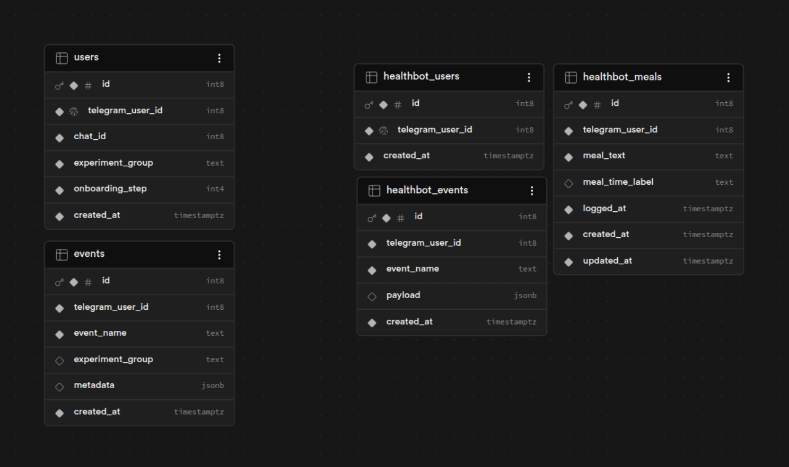
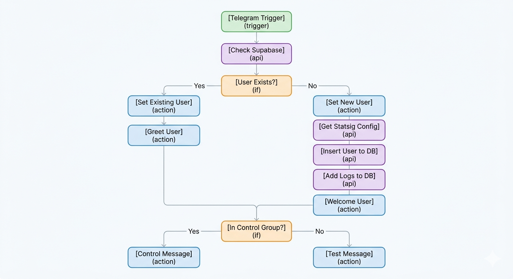
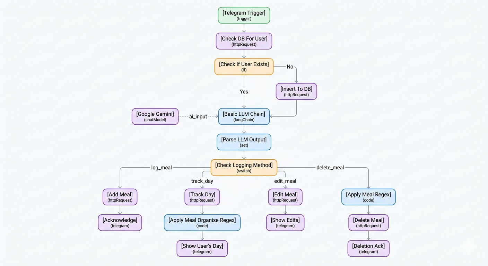

# CalorAI — Telegram Health & Experiment Bot

A production-ready Telegram bot system built with n8n, Supabase, Statsig, and Google Gemini.
It runs a live A/B experiment on new user onboarding and provides a full AI-powered meal
logging experience — all without a traditional backend server.

---

> 📖 For detailed step-by-step setup instructions for every service, refer to:
> **`N8N/WORKFLOW_SETUP_GUIDE.pdf`**

## 📌 Project Links

- 🎥 **YouTube Submission:** https://youtube.com/watch?v=fXQfEU5Tpoc  
- 📄 **Setup Guide (PDF):** https://canva.com/design/DAHFGipITBI/zMlAltd5DIpdmNN9uYHjeA/edit?utm_content=DAHFGipITBI&utm_campaign=designshare&utm_medium=link2&utm_source=sharebutton

---

## 📁 Repository Structure

```
CALORAI_assignment/
├── N8N/
│   ├── HEALTH_BOT/
│   │   ├── CALORAI_HEALTH_BOT.json     # n8n workflow — AI meal logging bot
│   │   └── Flowchart.png               # Health bot workflow diagram
│   ├── TASK1/
│   │   ├── CALOR_AI_TASK_1.json        # n8n workflow — A/B experiment
│   │   ├── Flowchart.png               # A/B experiment workflow diagram
│   │   └── TASK_1_EVALUATION_PLAN.md   # Full evaluation framework
│   └── WORKFLOW_SETUP_GUIDE.pdf        # Step-by-step setup guide (all services)
└── SUPABASE_DB.png                     # Supabase schema screenshot
```

---

## 🏗️ Architecture Overview

```
Telegram User
     │
     ▼
Telegram Bot (Webhook)
     │
     ▼
n8n (Workflow Automation)
     ├── CALOR_AI_TASK_1       →  Statsig (group assignment)
     │                         →  Supabase: users + events tables
     │
     └── CALORAI_HEALTH_BOT    →  Google Gemini (intent parsing)
                               →  Supabase: healthbot_users + healthbot_meals
                               →  Safety layer: rate limiting + abuse detection
```

---

## 🗄️ Database Schema

> Run both SQL blocks below in your **Supabase SQL Editor** before importing the workflows.

### Task 1 — A/B Experiment Tables

```sql
create table if not exists public.users (
  id                bigint generated always as identity primary key,
  telegram_user_id  bigint not null unique,
  chat_id           bigint not null,
  experiment_group  text not null check (experiment_group in ('control', 'test')),
  onboarding_step   integer not null default 0,
  created_at        timestamptz not null default now()
);

create table if not exists public.events (
  id                bigint generated always as identity primary key,
  telegram_user_id  bigint not null,
  event_name        text not null,
  experiment_group  text,
  metadata          jsonb default '{}'::jsonb,
  created_at        timestamptz not null default now()
);
```

### Task 2 — Health Bot Tables

```sql
create table if not exists public.healthbot_users (
  id                bigint generated always as identity primary key,
  telegram_user_id  bigint not null unique,
  daily_llm_calls   integer not null default 0,
  llm_call_date     date,
  created_at        timestamptz not null default now()
);

create table if not exists public.healthbot_meals (
  id                bigint generated always as identity primary key,
  telegram_user_id  bigint not null,
  meal_text         text not null,
  meal_time_label   text,
  logged_at         timestamptz not null default now(),
  created_at        timestamptz not null default now(),
  updated_at        timestamptz not null default now()
);

create table if not exists public.healthbot_events (
  id                bigint generated always as identity primary key,
  telegram_user_id  bigint not null,
  event_name        text not null,
  payload           jsonb default '{}'::jsonb,
  created_at        timestamptz not null default now()
);

create or replace function public.update_updated_at_column()
returns trigger as $$
begin
  new.updated_at = now();
  return new;
end;
$$ language plpgsql;

create trigger set_updated_at
before update on public.healthbot_meals
for each row execute function public.update_updated_at_column();
```

### Safety — Abuse Detection Table

```sql
create table if not exists public.flagged_users (
  id                bigint generated always as identity primary key,
  telegram_user_id  bigint not null unique,
  offense_count     integer not null default 1,
  last_offense_at   timestamptz not null default now(),
  is_blocked        boolean not null default false,
  created_at        timestamptz not null default now()
);
```

### Supabase Schema



---

## 🔁 Workflow 1 — A/B Experiment (CALOR_AI_TASK_1)



### What it does

Every time a user messages the bot, this workflow checks whether they are new or returning.
New users are assigned to a Control or Test group via Statsig, persisted in Supabase, and
sent the appropriate onboarding message. Returning users are greeted without being re-bucketed.

### Node breakdown

| Node | What it does |
|---|---|
| `Telegram Trigger` | Fires on every incoming message |
| `CHECK DB FOR USER INFO` | GET to Supabase `users` — looks up `telegram_user_id` |
| `CHECK IF USER EXISTS` | IF branch — true = existing user, false = new user |
| `Set Existing User` | Maps existing user fields from the DB response |
| `GREET USER` | Sends "Hi, welcome back" to returning users |
| `Set New User` | Sets `telegram_user_id`, `chat_id`, `onboarding_step = 0` |
| `STATSSIG EXPERIMENT` | POST to Statsig `/v1/get_config` — returns `control` or `test` |
| `INSERT TO DB` | POST to Supabase `users` — saves user with their assigned group |
| `ADD LOGS` | POST to Supabase `events` — logs `group_assigned` event |
| `WELCOME USER` | Sends "Welcome to CalorAI" to new users |
| `IF Group` | Routes based on `experiment_group` value |
| `CONTROL MESSAGE` | Sends a minimal one-line welcome to the control group |
| `TEST MESSAGE` | Sends a guided, example-rich welcome to the test group |

### Group experiences

| Group | Message |
|---|---|
| **Control** | "You can log meals and track your day." |
| **Test** | "I help you log meals and track your day in a simple way. You can send meals in plain English, for example: Ate 2 eggs and toast. Send your first meal now to get started." |

### Event logged on every new user

```json
{
  "telegram_user_id": "123456789",
  "event_name": "group_assigned",
  "experiment_group": "test",
  "metadata": {}
}
```

> 📋 For the full evaluation framework including primary metric, guardrail metrics, secondary
> metrics, and the pre-committed decision framework, see:
> **`N8N/TASK1/TASK_1_EVALUATION_PLAN.md`**

---

## 🤖 Workflow 2 — Health Bot (CALORAI_HEALTH_BOT)



### What it does

Every message is passed through Google Gemini with a strict intent-parsing prompt.
Gemini returns a raw JSON object classifying the user's intent, which is then routed
to the correct action — log, track, edit, or delete.

### Supported actions

| User says | Intent | Action |
|---|---|---|
| "I ate 2 eggs and toast" | `log_meal` | Saves meal to `healthbot_meals` |
| "Show my day" | `track_day` | Fetches today's meals, formats and replies |
| "Edit breakfast to 3 idlis" | `edit_meal` | PATCH — updates the meal entry |
| "Delete my lunch" | `delete_meal` | Extracts meal type via regex, then DELETE |
| Ambiguous or unrelated | `unknown` / `confirm` | Scaffolded — planned for next iteration |

### Node breakdown

| Node | What it does |
|---|---|
| `Telegram Trigger` | Fires on every incoming message |
| `CHECK DB FOR USER INFO1` | GET to Supabase `healthbot_users` — checks if user is registered |
| `CHECK IF USER EXISTS` | IF branch |
| `INSERT TO DB` | Registers new user in `healthbot_users` |
| `Basic LLM Chain` | Sends message to Gemini with a strict prompt — must return only raw JSON |
| `PARSE LLM OUTPUT` | Extracts the JSON object from Gemini's response |
| `CHECK LOGGING METHOD` | Switch node — routes by `action` field value |
| `ADD MEAL` | POST to `healthbot_meals` — saves meal text, label, and timestamp |
| `AKNOWLEDGE ENTRY` | Replies "Meal logged: X (label)" to the user |
| `TRACK DAY` | GET from `healthbot_meals` filtered to today's date range |
| `APPLY MEAL ORGANISE REGEX` | JS code — groups meals by label and formats the reply text |
| `SHOW USER'S DAY` | Sends formatted daily summary to user |
| `EDIT MEAL` | PATCH to `healthbot_meals` filtered by `meal_time_label` |
| `SHOW EDITS` | Confirms the edit back to the user |
| `APPLY MEAL REGEX` | JS code — extracts meal type keyword from `target_reference` |
| `DELETE MEAL` | DELETE from `healthbot_meals` filtered by `meal_time_label` |
| `DELETETION ACKNOLEDGEMENT` | Confirms deletion to the user |

---

## 🛡️ Safety Features

### LLM Rate Limiting — Per User Per Day

Each user has a `daily_llm_calls` counter and `llm_call_date` field in `healthbot_users`.
Before passing any message to Gemini, the workflow checks:

- If `llm_call_date` is today and `daily_llm_calls` exceeds the limit → reply with a friendly
  rate-limit message and skip the LLM call entirely
- If `llm_call_date` is a past date → reset the counter to 0 for today

This keeps API costs predictable and protects against spam without any extra infrastructure.

### Abuse Detection & Flagging System

An AI safety layer scans each incoming message for harmful or policy-violating content before
it reaches the main intent parser:

- Flagged messages are logged to the `flagged_users` table with the user's `telegram_user_id`
- Each entry tracks an `offense_count` — this increments on repeat offences
- After exceeding the max allowed offences (e.g. 3), `is_blocked` is set to `true`
- Blocked users receive a warning and their further messages are silently dropped
- The bot owner receives a Telegram notification when a user is blocked

This acts as a lightweight, self-maintaining moderation cache with no manual review needed
for obvious repeat offenders.

---

## ⚙️ Environment Variables

```env
# Supabase
SUPABASE_URL=https://<your-project-ref>.supabase.co
SUPABASE_API_KEY=<your-supabase-service-role-key>

# Statsig
STATSIG_SERVER_SECRET=<your-statsig-server-secret-key>

# Telegram
TELEGRAM_BOT_TOKEN=<your-telegram-bot-token>

# Google Gemini
GOOGLE_GEMINI_API_KEY=<your-gemini-api-key>
```

---

## 🚀 Setup Instructions

> 📖 **Full step-by-step setup with screenshots for every service is in:
> `N8N/WORKFLOW_SETUP_GUIDE.pdf`**
>
> The steps below are a quick-reference summary.

### Step 1 — Telegram

1. Message **@BotFather** on Telegram
2. Send `/newbot` and follow the prompts
3. Copy your **bot token**

### Step 2 — Supabase

1. Create a project at [supabase.com](https://supabase.com)
2. Open **SQL Editor** and run both schema blocks from the Database Schema section above
3. Go to **Project Settings → API** and copy your **Project URL** and **service_role key**

### Step 3 — Statsig

1. Create an account at [statsig.com](https://statsig.com)
2. Create a new **Experiment** named exactly: `telegram_onboarding_experiment`
3. Add two groups: `control` and `test` at 50/50 split
4. Copy your **Server Secret Key** from Settings → Keys

### Step 4 — Google Gemini

1. Go to [aistudio.google.com](https://aistudio.google.com) and generate an API key
2. Add it in n8n under **Credentials → Google Gemini (PaLM) API**

### Step 5 — n8n

This project uses **nvm** to manage Node versions.

```bash
# Install nvm
curl -o- https://raw.githubusercontent.com/nvm-sh/nvm/v0.39.7/install.sh | bash

# Install Node 18 and n8n
nvm install 18
nvm use 18
npm install -g n8n

# Start n8n
n8n start
# → runs at http://localhost:5678
```

**If running locally — you need to expose localhost to the internet for Telegram webhooks.**

Telegram requires a public HTTPS URL to deliver webhook events to your local machine.
Use **ngrok** to create a secure tunnel:

```bash
# Download ngrok from https://ngrok.com/download, then:
ngrok http 5678
```

ngrok will give you a public URL like `https://abc123.ngrok.io`.
Set this as your webhook base URL in n8n under **Settings → General → Webhook URL**.

**If deploying on a cloud VM — no ngrok needed:**

```bash
N8N_HOST=yourdomain.com \
N8N_PORT=443 \
N8N_PROTOCOL=https \
n8n start
```

Set up nginx + Let's Encrypt for SSL, point your domain to the VM IP, and Telegram
can reach your webhook directly.

### Step 6 — Import Workflows

1. In n8n go to **Workflows → Import from file**
2. Import `N8N/TASK1/CALOR_AI_TASK_1.json`
3. Import `N8N/HEALTH_BOT/CALORAI_HEALTH_BOT.json`
4. In each workflow, update all credentials (Telegram, Gemini) and replace the
   Supabase URL, API key, and Statsig secret with your own values
5. **Activate** both workflows using the toggle in the top right

---

## 🛠️ Tools & Services

| Tool | Why we used it |
|---|---|
| **n8n** | Visual workflow automation — wires up APIs, logic, and bots without boilerplate backend code |
| **Supabase** | Postgres-as-a-service with a built-in REST API — no backend server needed for DB access |
| **Statsig** | Purpose-built A/B testing with stable user bucketing and experiment config management |
| **Google Gemini** | LLM for intent parsing — handles natural language meal descriptions reliably with a strict JSON prompt |
| **Telegram Bot API** | Delivery channel — high open rates, no app install required for users |
| **ngrok** | Tunnels localhost to a public HTTPS URL for local Telegram webhook development |

---

## ⚖️ Trade-offs & Assumptions

**Test group onboarding is a single enriched message, not a full 3-step stateful flow.**
The `onboarding_step` field is persisted in the DB to make this extendable without any schema
change — the infrastructure is ready, the multi-step UX is the planned next iteration.
This was a deliberate time trade-off.

**Meal editing and deletion match on `meal_time_label`** rather than a unique meal ID.
Simpler to express in natural language and sufficient for the current scope, but could cause
ambiguity if a user logs two meals with the same label in one day.

**Gemini is prompted to return strict raw JSON only.** This removes the need for a dedicated
parsing model or function-calling setup, keeping the workflow simple while remaining reliable.

**Rate limiting is implemented at the workflow level** via Supabase counters rather than at
an API gateway — appropriate for the current scale, no additional infrastructure required.

---

## ⏱️ Time Breakdown

| Section | Time |
|---|---|
| Task 1 — A/B Experiment Workflow | ~1.5 hrs |
| Task 2 — Health Bot Workflow | ~2 hrs |
| Supabase schema & setup | ~30 min |
| Statsig configuration | ~20 min |
| Safety features | ~45 min |
| README & Evaluation Plan | ~45 min |
